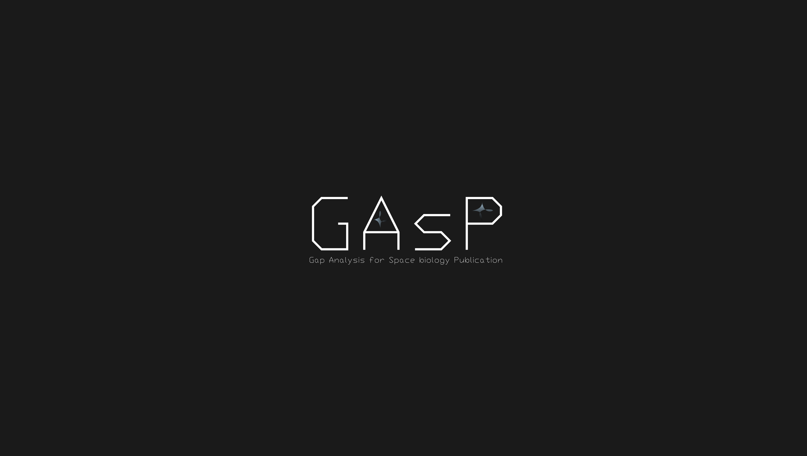
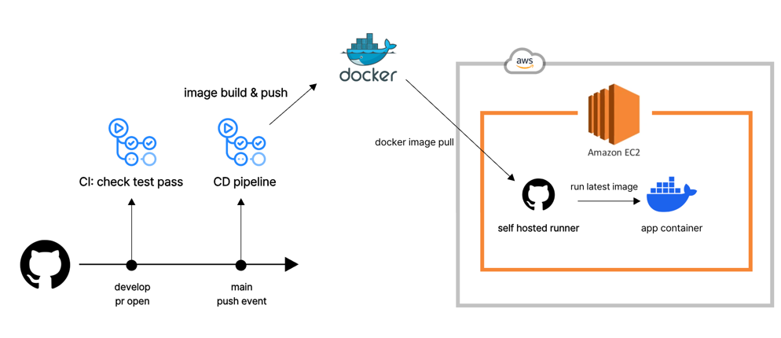
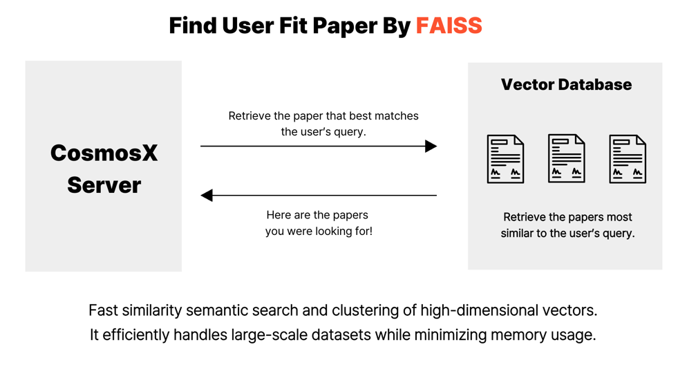
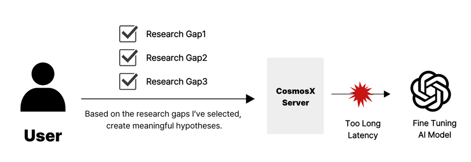
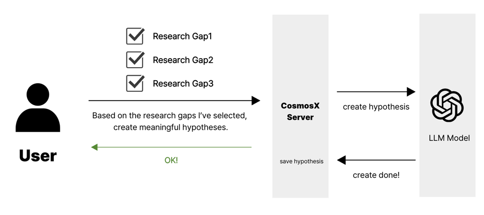

## 📝 Description

This is the backend repository for the NASA Apps Challenge CosmosX team.


Experience a faster and more accurate astrobiology search engine, 
taking you seamlessly from paper exploration to hypothesis formulation!

## **Contributors** 🙋🏻‍

|                                                   Geon Woo Kim                                                   |                                       Jae Won Kwak                                        |
|:----------------------------------------------------------------------------------------------------------------:|:-------------------------------------------------------------------------------------:|
|  |  |
|                                 [@coli-geonwoo](https://github.com/coli-geonwoo)                                 |                        [@jaewonE](https://github.com/jaewonE)                         |

<br>

## Tech Stack

| Category          | Technologies                                 |
| ----------------- | -------------------------------------------- |
| **Backend**       | FastAPI, Uvicorn                             |
| **Data & ML**     | NumPy, Pandas, Scikit-Learn, Joblib, PyArrow |
| **Config & Env**  | python-dotenv, python-decouple               |
| **Validation**    | Pydantic                                     |
| **Database**      | SQLAlchemy                                   |
| **File Handling** | python-multipart                             |
| **OpenAI API**    | OpenAI SDK                                   |
| **Testing**       | Pytest, Pytest-Cov, HTTPX                    |
| **Dev Tools**     | HTTPX (dev), Pytest (dev)                    |


## 🔄 CI & CD pipeline




### ✅ CI Pipeline

Trigger: When a pull request is opened to the develop branch

Actions:
- Run all pytest tests
- Verify that all tests pass

### ✅ CD Pipeline

Trigger: When a push is made to the main branch

Actions:
- On the GitHub Actions server, check out the main branch and build a Docker image
- Push the built image to Docker Hub
- A GitHub self-hosted runner on EC2 receives the request and deploys by pulling and running the latest image


## ⚙️ Technical Considerations

### FAISS – How to help users find papers faster?



We aimed to reduce the time over 400 users spent searching for astrobiology papers.
To achieve this, we preprocessed and extracted key sentences from around 500 papers and stored them in a vector database, enabling users to find papers most semantically relevant to their queries.
As a result, users can now more easily and quickly find papers aligned with their research areas and interests.


### How can we make the user experience of hypothesis generation more natural?




The service **GRASP** provides a feature that allows users to select research gaps and expand them into meaningful research hypotheses. However, using an LLM model in this process led to a drop in user experience due to slow response times.  

Each hypothesis generation took about 30 seconds to 1 minute, requiring users to wait before the hypothesis was created.




```python
    def create_hypothesis(
            self, request: HypothesisCreateRequest
    ) -> HypothesisCreateResponse:
        user_id = request.userId
        gaps_id = request.gapIds
        user_id = self._next_user_id(user_id)
        new_hypo = self._save_pending_hypo(user_id)

        self.hypothesis_repository.db.commit()

        #run background
        thread = threading.Thread(
            target=self._update_hypothesis_and_save_research,
            args=(gaps_id, new_hypo.id),
            daemon=True
        )
        thread.start()

        return HypothesisCreateResponse(userId = user_id)
```

Therefore, we decided to use asynchronous processing. When a user requests hypothesis generation, an immediate response is returned, allowing them to continue working while the hypothesis is being created.

Once the LLM model generates a user fit hypothesis, it is asynchronously saved to the database, ensuring that users do not experience delays due to slow response times.